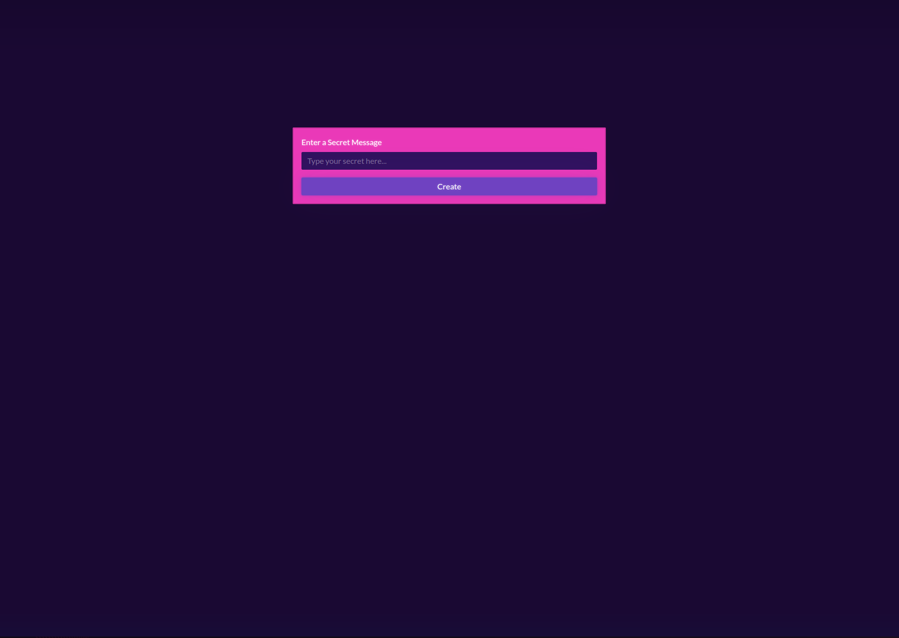

# Secret Message JS



A fun, minimalist web app that lets users **create encrypted secret messages** which can be shared via unique links. Built with **JavaScript** and styled using **Bootstrap 5 + Bootswatch Vapor** theme for a sleek, futuristic look.

🔐 Paste your message, get a unique link, and share it securely — no database needed!

---

## 🔗 Live Demo

👉 [Try the App on Netlify](https://secret-message-js1.netlify.app)
<br/>
<br/>
[](https://app.netlify.com/sites/secret-message-js1/deploys)

---

## 🚀 Features

- **Instant Encryption** using Base64 (in-browser only, no data stored)
- **Stylish UI** with [Bootswatch Vapor](https://bootswatch.com/vapor)
- **Mobile-Friendly** responsive layout
- **No Backend Needed** — lightweight, client-side only
- **One-Click Link Sharing** with auto-select input

---

## 🧰 Tech Stack

- [JavaScript (ES6+)](https://developer.mozilla.org/en-US/docs/Web/JavaScript)
- [Bootstrap 5](https://getbootstrap.com/)
- [Bootswatch Vapor Theme](https://bootswatch.com/vapor/)
- [Vite](https://vitejs.dev/) (for development bundling)

---

## 📦 Installation

Clone the repo and run locally with Vite:

```bash
git clone https://github.com/Breedlove-Jason/secret-message-js.git
cd secret-message-js
npm install
npm run dev
```

Then visit: `http://localhost:5173`

---

## 📁 Project Structure

```
secret-message-js/
├── index.html
├── src/
│   └── main.js
├── screenshot.png
└── README.md
```

---

## ✨ Upcoming Ideas

- [ ] Add “Copy Link” button with clipboard support
- [ ] Improve encryption using AES or Web Crypto API
- [ ] Add QR code generator for easier sharing

---

## 📄 License

MIT — feel free to use, fork, and improve!

---

Built with 💙 by [Jason Breedlove](https://github.com/Breedlove-Jason)
